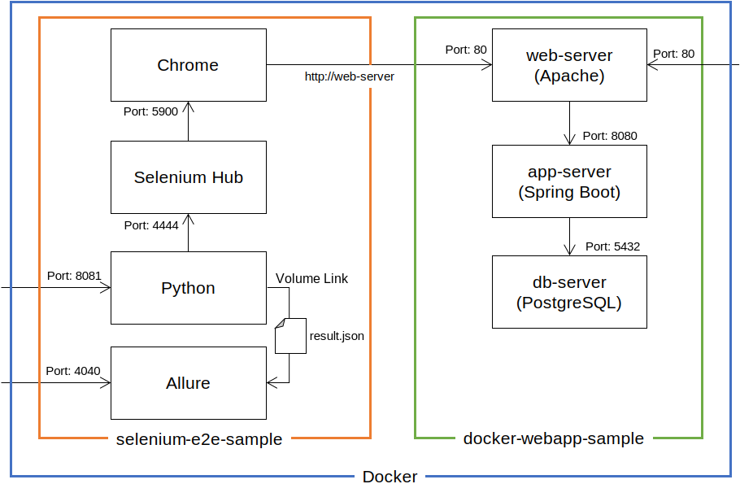

# selenium-e2e-sample

## Preface
The purpose of this project is to automatically test the UI of a web application.
This project uses Docker Compose, Selenium and Python.
It provides only the test environment in Docker. So, I recommend using  [docker-webapp-sample](https://github.com/ybkuroki/docker-webapp-sample) project as the Web Application.

## Install
Perform the following steps:

1. Install [Docker](https://www.docker.com/) in this command.
    ```bash
    yum install docker-ce
    ```
1. Install [Docker Compose](https://docs.docker.com/compose/).

## Starting Container
Perform the following steps:

1. Start containers of [docker-webapp-sample](https://github.com/ybkuroki/docker-webapp-sample) project by Docker Compose.
    ```bash
    docker-compose -f docker-compose_springboot.yml build
    docker-compose -f docker-compose_springboot.yml up -d
    ```
1. Build the ``docker-compose.yml`` of this project.
    ```bash
    docker-compose build
    ```
1. Start containers of this project by Docker Compose.
    ```bash
    docker-compose up -d
    ```

## Starting Test
Perform the following steps:

1. Start a bash session on a running container in the following command.
    ```bash
    docker exec -it python /bin/bash
    ```

1. Run tests in following commands.
    ```bash
    cd /script/testcases
    pytest --alluredir=/tmp/allure-results
    ```

## Architecture
There are two environments such as this figure: the test environment and the web application environment.



### Test Environment
The following is the summary of each container.

- Chrome Container
    - Test the web app in Chrome browser.
- Selenium Hub Container
    - Operate the browser of the Chrome container with Selenium.
- Python Container
    - Run Python test code.
- Allure Container
    - Display test results in Allure.

### Web Application Environment
The web application of [docker-webapp-sample](https://github.com/ybkuroki/docker-webapp-sample) project consists of three containers: web, app and db.

For more information about this application, see:

- [vuejs-webapp-sample](https://github.com/ybkuroki/vuejs-webapp-sample)
- [springboot-webapp-sample](https://github.com/ybkuroki/springboot-webapp-sample)

The web application to be tested must support chrome or firefox.

## Project Map
The follwing figure is the map of this sample project.

```
+ docker                    ... Dockerfile for the python container.
- script
  + commons                 ... Define common functions.
  + pages                   ... Define operations for each input element. 
  + testflow                ... Define user operations of each page. A page uses a page object.
  + testcase                ... Define testcases. A testcase uses a testflow.
  - application.yml         ... Define test configuration.
- volumes/allure-results    ... Volume link directory for test results.
- cache-clean.sh            ... Shell Script for clean pycache.
- docker-compose.yml
```

## Links
The following is links to access a website of each container.
Assume the IP address of Docker Engine is `localhost`.

- Selenium Hub
    - [http://localhost:4444/grid/console](http://localhost:4444/grid/console)
- Allure
    - [http://localhost:4040/](http://localhost:4040/)
- Target Web Application
    - [http://localhost/](http://localhost/)

## License
The License of this sample is *MIT License*.
